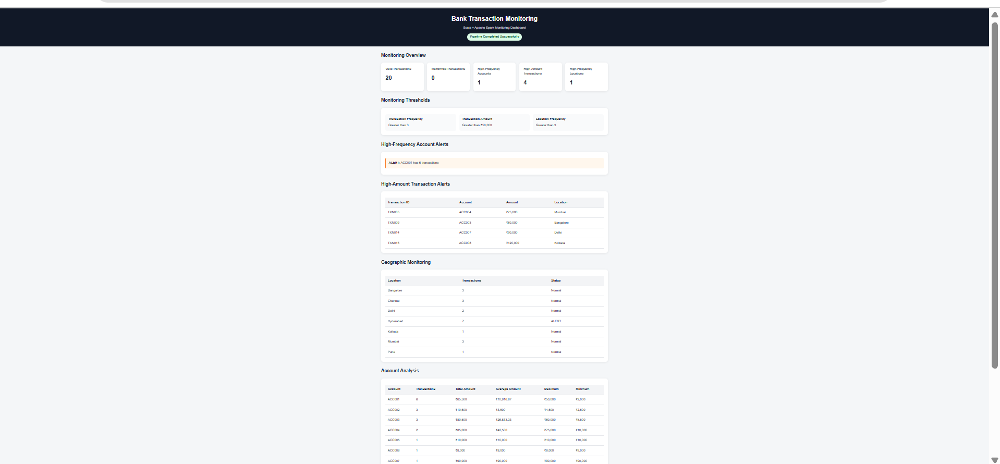

# Bank Transaction Monitoring

A Scala and Apache Spark mini-project for monitoring bank transactions and identifying unusual transaction frequency, high-value transactions, and unusual geographic activity.

## 🌐 Live Dashboard

The monitoring dashboard is deployed using GitHub Pages.

👉 **[Open Live Dashboard](https://chinthavishnupriya.github.io/bank-transaction-monitoring/)**



The dashboard displays:
- Valid and malformed transaction counts
- High-frequency account alerts
- High-amount transaction alerts
- Geographic transaction monitoring
- Account-level statistics
- Transaction-type statistics
- Spark partition information

## 1. Project Overview

This project implements a bank transaction monitoring pipeline using Scala and Apache Spark. The system processes transaction records and identifies potentially unusual activity using three monitoring rules:

1. High transaction frequency for an account
2. High transaction amount
3. High transaction activity from a geographic location

The project demonstrates both batch and streaming-oriented Spark processing.

## 2. Objectives

- Read and validate transaction records from CSV files.
- Count transactions for each account.
- Detect unusually high transaction frequency.
- Detect high-value transactions.
- Detect locations with unusually high transaction activity.
- Demonstrate stateful streaming with `updateStateByKey`.
- Demonstrate sliding-window processing.
- Use broadcast variables for monitoring thresholds.
- Use an accumulator for malformed records.
- Demonstrate caching and partition management.
- Perform DataFrame analytical aggregations.
- Explain DAG, stages, shuffle, lineage, and fault tolerance.

## 3. Technology Stack

| Technology | Version |
|---|---|
| Scala | 2.12.18 |
| Apache Spark | 3.5.6 |
| Java | 17 |
| sbt | 2.0.7 |
| Spark Core | 3.5.6 |
| Spark SQL | 3.5.6 |
| Spark Streaming | 3.5.6 |
| Execution Mode | Local |

## 4. Project Structure

```text
bank-transaction-monitoring/
├── build.sbt
├── .gitignore
├── project/
│   └── build.properties
├── src/
│   └── main/
│       └── scala/
│           ├── Models.scala
│           ├── BatchProcessor.scala
│           ├── StreamingProcessor.scala
│           ├── WindowProcessor.scala
│           └── FinalMonitoringProcessor.scala
├── data/
│   ├── input/
│   │   ├── transactions.csv
│   │   ├── stream/
│   │   └── window/
│   ├── reference/
│   └── output/
├── docs/
│   ├── index.html
│   └── dashboard-preview.png
├── outputs/
│   ├── batch-output.txt
│   ├── spark-submit-output.txt
│   ├── streaming-output.txt
│   └── window-output.txt
└── README.md
```

## 5. Transaction Schema

| Field | Type | Description |
|---|---|---|
| transactionId | String | Unique transaction identifier |
| accountId | String | Bank account identifier |
| customerId | String | Customer identifier |
| transactionType | String | DEPOSIT, WITHDRAWAL, or TRANSFER |
| amount | Double | Transaction amount |
| timestamp | String | Transaction timestamp |
| location | String | Transaction location |

Example:

```csv
transactionId,accountId,customerId,transactionType,amount,timestamp,location
TXN001,ACC001,CUST001,DEPOSIT,50000,2026-09-03T09:00:00,Hyderabad
TXN002,ACC001,CUST001,WITHDRAWAL,5000,2026-09-03T09:15:00,Hyderabad
TXN003,ACC002,CUST002,TRANSFER,2500,2026-09-03T09:20:00,Chennai
```

## 6. Monitoring Thresholds

| Rule | Threshold |
|---|---:|
| Account transaction frequency | 3 |
| High transaction amount | 50000 |
| Geographic transaction frequency | 3 |

The monitoring logic reports values that **exceed** the configured threshold. Therefore, a frequency of exactly 3 is not reported; a frequency greater than 3 is reported.

## 7. Sample Dataset

The sample dataset contains **20 valid transactions**.

### Account Counts

| Account | Transactions |
|---|---:|
| ACC001 | 6 |
| ACC002 | 3 |
| ACC003 | 3 |
| ACC004 | 2 |
| ACC005 | 1 |
| ACC006 | 1 |
| ACC007 | 1 |
| ACC008 | 1 |
| ACC009 | 1 |
| ACC010 | 1 |

### Location Counts

| Location | Transactions |
|---|---:|
| Hyderabad | 7 |
| Chennai | 3 |
| Bangalore | 3 |
| Mumbai | 3 |
| Delhi | 2 |
| Kolkata | 1 |
| Pune | 1 |

## 8. Data Model

`Models.scala` defines the transaction model:

```scala
case class BankTransaction(
  transactionId: String,
  accountId: String,
  customerId: String,
  transactionType: String,
  amount: Double,
  timestamp: String,
  location: String
)
```

## 9. Batch Processing

`BatchProcessor.scala` implements the main batch workflow:

1. Create a `SparkSession`.
2. Read the CSV file.
3. Skip the header.
4. Parse and validate records.
5. Count malformed records using an accumulator.
6. Cache the parsed transaction RDD.
7. Create a Pair RDD using `(accountId, 1)`.
8. Use `reduceByKey` to count transactions per account.
9. Broadcast monitoring thresholds.
10. Detect high-frequency accounts.
11. Detect high-value transactions.
12. Count transactions by location.
13. Detect high-frequency locations.
14. Demonstrate `repartition` and `coalesce`.
15. Convert transactions to a DataFrame.
16. Perform analytical aggregations.
17. Release cached and broadcast resources.
18. Stop Spark.

## 10. Pair RDD Processing

```scala
val accountPairs = transactions.map(tx => (tx.accountId, 1))
val accountCounts = accountPairs.reduceByKey(_ + _)
```

`reduceByKey` performs key-based aggregation and can require a shuffle when matching keys are distributed across partitions.

## 11. High-Frequency Account Monitoring

With a frequency threshold of 3 and an exceeds-threshold rule:

```text
ACC001 -> 6 transactions
```

Therefore:

```text
High-frequency accounts: 1
```

## 12. High-Amount Transaction Monitoring

The following transactions exceed ₹50,000:

| Transaction | Account | Amount | Location |
|---|---|---:|---|
| TXN005 | ACC004 | 75000 | Mumbai |
| TXN009 | ACC003 | 60000 | Bangalore |
| TXN014 | ACC007 | 90000 | Delhi |
| TXN015 | ACC008 | 120000 | Kolkata |

Result:

```text
High-amount transactions: 4
```

## 13. Geographic Monitoring

With a geographic threshold of 3, only Hyderabad exceeds the threshold:

```text
Hyderabad -> 7 transactions
```

Result:

```text
High-frequency locations: 1
```

## 14. Stateful Streaming Processing

`StreamingProcessor.scala` demonstrates stateful Spark Streaming using `updateStateByKey`.

The processor:

- Watches `data/input/stream`.
- Processes newly arriving files as micro-batches.
- Maintains cumulative account transaction counts.
- Uses checkpointing for state recovery.

Observed state includes:

```text
ACC001 -> 6 transactions
ACC002 -> 3 transactions
ACC003 -> 3 transactions
ACC004 -> 2 transactions
...
ACC010 -> 1 transactions
```

This demonstrates that account state is maintained across streaming micro-batches.

## 15. Sliding Window Processing

`WindowProcessor.scala` uses:

```scala
window(
  Seconds(15),
  Seconds(5)
)
```

Therefore:

- Window duration = 15 seconds
- Sliding interval = 5 seconds

The processor continuously evaluates the most recent 15 seconds of streaming data and updates the result every 5 seconds.

## 16. Broadcast Variables

The project broadcasts these small, read-only monitoring thresholds:

```text
Frequency threshold = 3
Amount threshold = 50000
Geographic threshold = 3
```

This avoids repeatedly shipping the same configuration with individual tasks.

## 17. Accumulator

The `malformedTransactions` accumulator counts transaction records that cannot be parsed correctly.

For the sample data:

```text
Valid transactions: 20
Malformed transactions: 0
```

## 18. Cache and Persist

The parsed transaction RDD is reused by several operations, so caching is demonstrated:

```scala
transactions.cache()
```

The cached RDD is released after the required computations are complete.

## 19. Narrow and Wide Transformations

### Narrow Transformations

Examples include:

- `map`
- `filter`
- `mapValues`

These do not require a full shuffle between partitions.

### Wide Transformations

Examples include:

- `reduceByKey`
- `groupByKey`
- `repartition`

These can require data movement between partitions and create shuffle boundaries.

## 20. DAG and Stages

A simplified execution flow is:

```text
Input CSV
   |
   v
Parse and Validate
   |
   v
Cached Transactions
   |
   +--------------------+
   |                    |
   v                    v
Pair RDD             DataFrame
   |                    |
   v                    v
reduceByKey         groupBy / agg
   |                    |
   v                    v
Account Alerts      Analytics
```

Spark divides jobs into stages around shuffle boundaries. The exact number of stages depends on the action and execution plan.

## 21. Shuffle

A shuffle redistributes data between partitions. In this project, account aggregation using `reduceByKey` is a major example.

```text
Partition 1 ----\
Partition 2 ----- > Shuffle by accountId ---> Aggregated partitions
Partition 3 ----/
```

Shuffle can introduce network and serialization overhead.

## 22. Partition Management

The project demonstrates:

```scala
repartition(4)
```

followed by:

```scala
coalesce(2)
```

Observed sequence:

```text
Initial partitions : 2
After repartition  : 4
After coalesce     : 2
```

| Operation | Typical Purpose | Shuffle |
|---|---|---|
| `repartition(n)` | Increase or decrease partitions | Yes |
| `coalesce(n)` | Usually reduce partitions | Usually avoids a full shuffle |

## 23. DataFrame Aggregations

The final processor converts transactions to a DataFrame and calculates:

- Transaction count by account
- Total amount by account
- Average amount by account
- Maximum and minimum amount by account
- Transaction count by type
- Total amount by type
- Average amount by type
- Transaction count by location
- Total amount by location

Example:

| Account | Count | Total Amount | Average Amount |
|---|---:|---:|---:|
| ACC001 | 6 | 65500 | 10916.67 |
| ACC002 | 3 | 10500 | 3500.00 |
| ACC003 | 3 | 80500 | 26833.33 |
| ACC004 | 2 | 85000 | 42500.00 |

## 24. Transaction-Type Analysis

| Type | Count | Total Amount | Average Amount |
|---|---:|---:|---:|
| DEPOSIT | 3 | 85000 | 28333.33 |
| TRANSFER | 10 | 277000 | 27700.00 |
| WITHDRAWAL | 7 | 139500 | 19928.57 |

## 25. Location Analysis

| Location | Count | Total Amount |
|---|---:|---:|
| Bangalore | 3 | 80500 |
| Chennai | 3 | 10500 |
| Delhi | 2 | 100000 |
| Hyderabad | 7 | 72500 |
| Kolkata | 1 | 120000 |
| Mumbai | 3 | 110000 |
| Pune | 1 | 8000 |

## 26. Spark SQL, Joins, Windows and UDFs

The implemented monitoring rules use DataFrame aggregations directly. The architecture can be extended with:

- Spark SQL queries
- Reference-table joins
- Window functions for time-based account analysis
- UDFs for custom transaction classification

These are useful extensions for customer profiles, account metadata, risk categories, and advanced monitoring rules.

## 27. Fault Tolerance and RDD Lineage

Spark maintains lineage information for RDD transformations. If a partition is lost, Spark can recompute the required data from lineage rather than requiring the complete dataset to be stored redundantly in memory.

The stateful streaming processor also uses checkpointing to support recovery of maintained streaming state.

## 28. YARN Deployment Concept

The project was validated locally, but the application can conceptually be submitted to a YARN cluster:

```bash
spark-submit \
  --master yarn \
  --class FinalMonitoringProcessor \
  bank-transaction-monitoring.jar
```

## 29. Running the Project

### Compile and Package

```bash
sbt clean
sbt package
```

### Batch Processor

```bash
sbt "runMain BatchProcessor"
```

### Final Monitoring Processor

```bash
sbt "runMain FinalMonitoringProcessor"
```

### Stateful Streaming Processor

```bash
sbt "runMain StreamingProcessor"
```

### Window Processor

```bash
sbt "runMain WindowProcessor"
```

### Spark Submit

```bash
spark-submit \
  --conf spark.hadoop.fs.defaultFS=file:/// \
  --class FinalMonitoringProcessor \
  --master local[*] \
  bank-transaction-monitoring.jar
```

The `spark.hadoop.fs.defaultFS=file:///` setting was required in the tested local environment so project input paths resolve through the local filesystem.

## 30. Java 17 Spark Configuration

For the tested Java 17 environment, Spark execution used:

```bash
export JAVA_TOOL_OPTIONS="--add-opens=java.base/java.lang=ALL-UNNAMED \
--add-opens=java.base/java.lang.invoke=ALL-UNNAMED \
--add-opens=java.base/java.nio=ALL-UNNAMED \
--add-opens=java.base/java.util=ALL-UNNAMED \
--add-opens=java.base/sun.nio.ch=ALL-UNNAMED"
```

## 31. Actual Execution Results

The final Spark-submit execution completed successfully with:

```text
Monitoring thresholds:
Frequency: > 3
Amount: > ₹50000.00
Location: > 3

Input summary:
Total valid transactions: 20
Malformed transactions: 0

High-frequency account alerts:
ALERT -> ACC001 has 6 transactions

High amount alerts:
TXN005 | ACC004 | ₹75000 | Mumbai
TXN009 | ACC003 | ₹60000 | Bangalore
TXN014 | ACC007 | ₹90000 | Delhi
TXN015 | ACC008 | ₹120000 | Kolkata

High-frequency location:
ALERT -> Hyderabad has 7 transactions

Partitions:
Original: 2
After repartition(4): 4
After coalesce(2): 2

Summary:
Valid transactions: 20
Malformed transactions: 0
High-frequency accounts: 1
High-amount transactions: 4
High-frequency locations: 1
Final monitoring pipeline completed.
```

## 32. Ubuntu Execution Evidence

The repository includes the actual terminal outputs captured during Ubuntu/WSL execution. These files provide reproducible execution evidence for the main project components.

| Component | Output |
|---|---|
| Batch processing | [View `batch-output.txt`](outputs/batch-output.txt) |
| Final Spark submit | [View `spark-submit-output.txt`](outputs/spark-submit-output.txt) |
| Stateful streaming | [View `streaming-output.txt`](outputs/streaming-output.txt) |
| Sliding window | [View `window-output.txt`](outputs/window-output.txt) |

### Verified execution evidence

- Spark 3.5.6 executed successfully.
- Java 17 executed successfully.
- Batch processing processed 20 valid transactions.
- Malformed transaction count was 0.
- One high-frequency account was detected: ACC001.
- Four high-amount transactions were detected.
- One high-frequency location was detected: Hyderabad.
- Stateful streaming maintained account counts.
- Sliding-window processing ran with a 15-second window and 5-second slide.
- Partition management demonstrated `2 → 4 → 2`.

## 33. Architecture

```text
                +----------------------+
                | transactions.csv     |
                +----------+-----------+
                           |
                           v
                +----------------------+
                | CSV Parsing/Validate |
                +----------+-----------+
                           |
                           v
                +----------------------+
                | Spark Transaction RDD|
                +----------+-----------+
                           |
              +------------+------------+
              |            |            |
              v            v            v
        Account RDD   Amount Rules   Location RDD
              |            |            |
              v            v            v
        Frequency       Alerts       Geo Alerts
              |            |            |
              +------------+------------+
                           |
                           v
                +----------------------+
                | DataFrame Analytics  |
                +----------+-----------+
                           |
                           v
                +----------------------+
                | Monitoring Results   |
                +----------+-----------+
                           |
                           v
                +----------------------+
                | GitHub Pages Dashboard|
                +----------------------+
```

## 34. Learning Outcomes

This project demonstrates practical knowledge of:

- Scala programming
- Apache Spark fundamentals
- RDD processing
- Pair RDDs
- Stateful streaming
- Window operations
- Broadcast variables
- Accumulators
- Caching
- DataFrames and aggregations
- Partition management
- Narrow and wide transformations
- DAG and stage concepts
- Shuffle behavior
- RDD lineage
- Fault tolerance
- Spark deployment concepts
- Git and GitHub project management
- GitHub Pages dashboard deployment

## 35. Project Checklist

| Requirement | Status |
|---|---|
| Scala implementation | ✅ |
| Spark RDD processing | ✅ |
| Pair RDD operations | ✅ |
| Account frequency monitoring | ✅ |
| Amount monitoring | ✅ |
| Geographic monitoring | ✅ |
| Stateful streaming | ✅ |
| Sliding windows | ✅ |
| Broadcast variables | ✅ |
| Accumulator | ✅ |
| Cache/persist | ✅ |
| DataFrame aggregations | ✅ |
| Partition management | ✅ |
| Repartition vs coalesce | ✅ |
| DAG/stage/shuffle explanation | ✅ |
| RDD lineage/fault tolerance | ✅ |
| Ubuntu execution evidence | ✅ |
| Live dashboard | ✅ |
| GitHub Pages deployment | ✅ |

## 36. Author

**Chintha Vishnupriya**

Project: **Bank Transaction Monitoring**

Technology: **Scala + Apache Spark**

Repository: `chinthavishnupriya/bank-transaction-monitoring`
